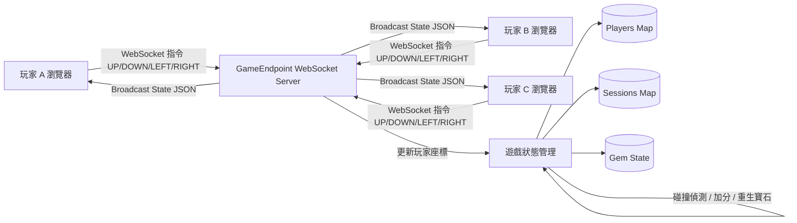
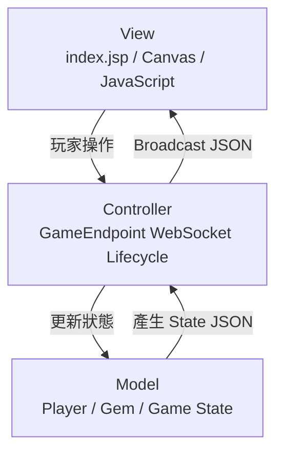
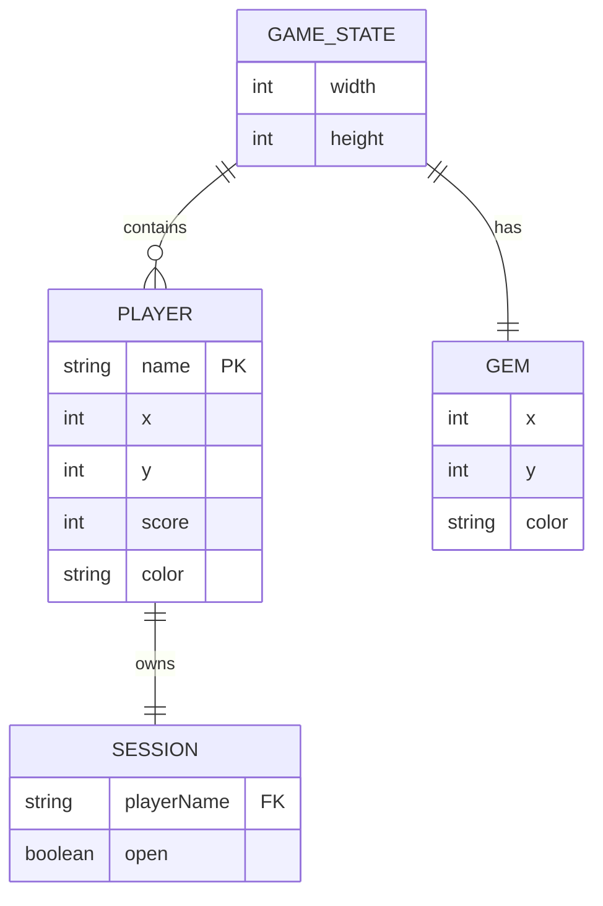
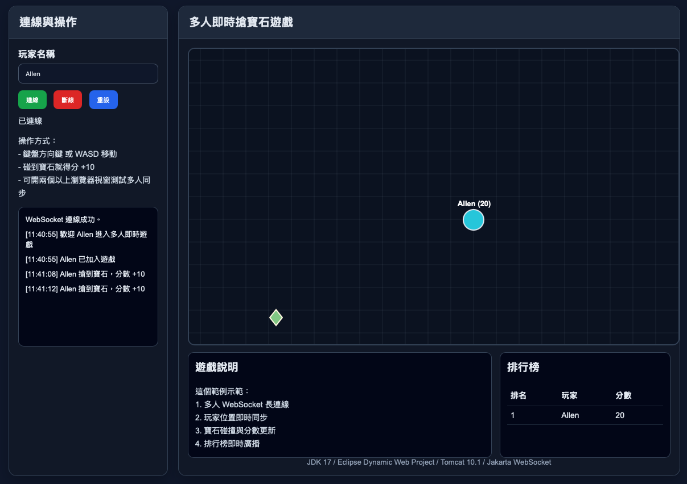

# WebSocketGameDynamic

> 一個使用 **Java Jakarta WebSocket** 製作的多人即時 2D 寶石收集遊戲。玩家可透過瀏覽器連線進入同一個遊戲房間，即時移動角色、搶奪寶石、累積分數，並同步看到其他玩家的位置與分數變化。

---

## 目錄

- [專案介紹](#專案介紹)
- [技術架構](#技術架構)
- [系統架構圖](#系統架構圖)
- [MVC架構圖](#mvc架構圖)
- [ER Diagram](#er-diagram)
- [功能介紹](#功能介紹)
- [系統畫面](#系統畫面)
- [專案結構](#專案結構)
- [Database Schema](#database-schema)
- [安裝方式](#安裝方式)
- [問題與解決方案](#問題與解決方案)
- [未來優化方向](#未來優化方向)
- [學習心得](#學習心得)

---

## 專案介紹

`WebSocketGameDynamic` 是一個多人即時互動的 2D 小遊戲專案，主要目標是練習 **WebSocket 即時通訊**、**多人狀態同步**、**Java Web 後端事件處理** 與 **前後端即時資料交換**。

玩家進入遊戲後，後端會依照玩家名稱建立連線，並隨機產生玩家位置與顏色。玩家可透過方向鍵或前端按鈕傳送 `UP`、`DOWN`、`LEFT`、`RIGHT` 指令給 WebSocket Server，Server 更新角色位置後會廣播最新遊戲狀態給所有玩家。

當玩家碰到寶石時，系統會自動加分、重新產生寶石位置，並廣播系統訊息，讓所有線上玩家即時看到狀態變化。

### 專案特色

- 使用 WebSocket 建立即時雙向通訊
- 支援多人同時進入遊戲
- 玩家移動即時同步
- 寶石碰撞偵測與加分機制
- 玩家加入、離開、得分皆會廣播通知
- 使用記憶體保存遊戲狀態，適合作為 WebSocket 入門實作

---

## 技術架構

| 分類 | 使用技術 | 說明 |
|---|---|---|
| 後端語言 | Java | 主要遊戲邏輯與 WebSocket Server |
| WebSocket API | Jakarta WebSocket | 使用 `@ServerEndpoint` 建立 WebSocket 端點 |
| Web 規格 | Jakarta EE / Servlet 6.0 | `web.xml` 使用 Jakarta EE namespace 與 web-app 6.0 |
| 前端頁面 | JSP / HTML / JavaScript | `web.xml` 預設首頁為 `index.jsp` |
| 即時通訊 | WebSocket | Client 與 Server 雙向同步遊戲狀態 |
| 資料儲存 | Java Memory | 使用 `ConcurrentHashMap` 保存玩家與 Session |
| 部署環境 | Tomcat 10.1+ / GlassFish 7+ / Payara 6+ | 需支援 Jakarta namespace |

### 核心 WebSocket Endpoint

```java
@ServerEndpoint("/game/{playerName}")
public class GameEndpoint {
    // WebSocket lifecycle methods
}
```

WebSocket 連線格式：

```text
ws://localhost:8080/WebSocketGameDynamic/game/{playerName}
```

例如：

```text
ws://localhost:8080/WebSocketGameDynamic/game/Tim
```

---

## 系統架構圖



### 系統流程說明

1. 玩家在瀏覽器輸入名稱並建立 WebSocket 連線。
2. Server 建立玩家物件，隨機產生初始位置與顏色。
3. 玩家傳送移動指令給 Server。
4. Server 更新玩家座標並檢查是否碰到寶石。
5. 若碰到寶石，玩家分數加 10，寶石重新產生。
6. Server 將最新遊戲狀態廣播給所有玩家。
7. 前端收到 JSON 後重新繪製畫面。

---

## MVC架構圖

本專案屬於即時 WebSocket 遊戲，並非傳統完整 CRUD 型 MVC 專案，因此可以用「類 MVC」方式理解：



### MVC 對應說明

| MVC 層 | 對應內容 | 說明 |
|---|---|---|
| Model | `Player`、`Gem`、`PLAYERS`、`gem` | 保存玩家座標、分數、顏色與寶石位置 |
| View | `index.jsp` / 前端 Canvas | 顯示遊戲畫面、玩家、寶石、分數與系統訊息 |
| Controller | `GameEndpoint` | 接收 WebSocket 訊息、處理移動、碰撞、廣播狀態 |

---

## ER Diagram

目前專案沒有使用 MySQL 或其他資料庫，所有資料都暫存在 Java 記憶體中。因此以下 ER Diagram 是以「遊戲資料模型」呈現，方便面試時說明資料結構與未來擴充方向。



### 資料模型說明

| 資料模型 | 欄位 | 說明 |
|---|---|---|
| Player | `name` | 玩家名稱，若重複會自動加上流水號 |
| Player | `x`, `y` | 玩家目前座標 |
| Player | `score` | 玩家分數 |
| Player | `color` | 玩家顏色 |
| Gem | `x`, `y` | 寶石目前座標 |
| Gem | `color` | 寶石顏色 |
| Session | `playerName` | WebSocket Session 對應的玩家名稱 |

---

## 功能介紹

### 1. 玩家加入遊戲

玩家透過 WebSocket URL 中的 `{playerName}` 進入遊戲：

```text
/game/{playerName}
```

Server 會處理以下事項：

- 清理玩家名稱，避免非法字元
- 若玩家名稱重複，自動產生唯一名稱
- 隨機產生玩家初始座標
- 隨機產生玩家顏色
- 將玩家加入 `PLAYERS`
- 將連線加入 `SESSIONS`
- 廣播玩家加入訊息

---

### 2. 玩家移動

前端可傳送以下字串指令：

| 指令 | 說明 |
|---|---|
| `UP` | 玩家向上移動 |
| `DOWN` | 玩家向下移動 |
| `LEFT` | 玩家向左移動 |
| `RIGHT` | 玩家向右移動 |
| `RESET` | 重設玩家位置與分數 |

移動時會限制玩家不可超出遊戲邊界。

---

### 3. 寶石碰撞偵測

Server 會根據玩家與寶石的座標計算距離：

```java
int dx = player.x - gem.x;
int dy = player.y - gem.y;
int distanceSquared = dx * dx + dy * dy;
int target = PLAYER_RADIUS + GEM_RADIUS;
```

當距離小於玩家半徑與寶石半徑總和時，代表玩家碰到寶石：

- 玩家分數 `+10`
- 寶石重新隨機產生位置
- 寶石重新隨機產生顏色
- 廣播玩家得分訊息

---

### 4. 即時廣播遊戲狀態

每次玩家移動或遊戲狀態改變時，Server 會產生 JSON 並廣播給所有線上玩家。

狀態 JSON 範例：

```json
{
  "type": "state",
  "width": 860,
  "height": 520,
  "gem": {
    "x": 320,
    "y": 180,
    "color": "#ffd54f"
  },
  "players": [
    {
      "name": "Tim",
      "x": 100,
      "y": 200,
      "score": 10,
      "color": "#42a5f5"
    }
  ]
}
```

---

### 5. 玩家離開遊戲

當 WebSocket 連線關閉時，Server 會：

- 從 `SESSIONS` 移除該玩家連線
- 從 `PLAYERS` 移除玩家資料
- 廣播玩家離開訊息
- 廣播最新遊戲狀態

---

## 系統畫面

> 目前上傳檔案中未包含實際系統截圖，以下先提供 README 可用的截圖區塊。建議將圖片放在 `docs/images/` 目錄中，再替換下方圖片路徑。

### 首頁 / 玩家登入畫面



畫面說明：玩家輸入名稱後進入 WebSocket 遊戲房間。


## 專案結構

根據目前上傳檔案，可整理為以下結構：

```text
WebSocketGameDynamic/
├── README.md
├── src/
│   └── main/
│       ├── java/
│       │   └── com/
│       │       └── codebyx/
│       │           └── game/
│       │               └── GameEndpoint.java
│       └── webapp/
│           ├── index.jsp
│           └── WEB-INF/
│               └── web.xml
└── build/
    └── classes/
        └── com/
            └── codebyx/
                └── game/
                    ├── GameEndpoint.class
                    ├── GameEndpoint$Player.class
                    └── GameEndpoint$Gem.class
```

> 注意：實際專案目錄可能會依照 IDE（Eclipse、NetBeans）或 Maven / Gradle 設定略有不同。

---

## Database Schema

### 目前版本

目前專案沒有連接資料庫，也沒有 SQL Table。遊戲資料皆儲存在 Java 記憶體中：

| 儲存位置 | 型別 | 用途 |
|---|---|---|
| `SESSIONS` | `Map<String, Session>` | 保存玩家名稱與 WebSocket Session |
| `PLAYERS` | `Map<String, Player>` | 保存玩家名稱與玩家狀態 |
| `gem` | `Gem` | 保存目前寶石的位置與顏色 |

---

### 未來可擴充資料表設計

若要加入排行榜、歷史紀錄、玩家帳號，可擴充以下資料表。

```sql
CREATE TABLE players (
    id BIGINT PRIMARY KEY AUTO_INCREMENT,
    username VARCHAR(100) NOT NULL UNIQUE,
    created_at TIMESTAMP DEFAULT CURRENT_TIMESTAMP
);

CREATE TABLE game_scores (
    id BIGINT PRIMARY KEY AUTO_INCREMENT,
    player_id BIGINT NOT NULL,
    score INT NOT NULL,
    played_at TIMESTAMP DEFAULT CURRENT_TIMESTAMP,
    FOREIGN KEY (player_id) REFERENCES players(id)
);

CREATE TABLE game_events (
    id BIGINT PRIMARY KEY AUTO_INCREMENT,
    player_id BIGINT,
    event_type VARCHAR(50) NOT NULL,
    message VARCHAR(255),
    created_at TIMESTAMP DEFAULT CURRENT_TIMESTAMP,
    FOREIGN KEY (player_id) REFERENCES players(id)
);
```

---

## 安裝方式

### 環境需求

| 工具 | 建議版本 |
|---|---|
| JDK | 17+ |
| Servlet Container | Tomcat 10.1+ / GlassFish 7+ / Payara 6+ |
| IDE | Eclipse / NetBeans / IntelliJ IDEA |
| Browser | Chrome / Edge / Safari / Firefox |

> 因為專案使用 `jakarta.websocket`，請使用支援 Jakarta namespace 的伺服器，例如 Tomcat 10.1+。Tomcat 9 使用的是 `javax.*`，不適合直接部署此版本。

---

### 1. 下載專案

```bash
git clone https://github.com/s717456/WebSocketGameDynamic.git
cd WebSocketGameDynamic
```

---

### 2. 匯入 IDE

以 Eclipse 為例：

1. 開啟 Eclipse
2. 選擇 `File` → `Import`
3. 選擇 `Existing Projects into Workspace`
4. 選擇專案資料夾
5. 確認 JDK 設定為 17 以上
6. 將專案部署到 Tomcat 10.1+

---

### 3. 確認 web.xml

`web.xml` 應位於：

```text
src/main/webapp/WEB-INF/web.xml
```

內容需包含：

```xml
<welcome-file-list>
    <welcome-file>index.jsp</welcome-file>
</welcome-file-list>
```

---

### 4. 啟動伺服器

啟動 Tomcat 後，開啟瀏覽器：

```text
http://localhost:8080/WebSocketGameDynamic/
```

WebSocket 連線端點：

```text
ws://localhost:8080/WebSocketGameDynamic/game/Tim
```

---

### 5. 多人測試

可以使用以下方式測試多人同步：

1. 開啟兩個不同瀏覽器視窗
2. 分別輸入不同玩家名稱
3. 操作其中一位玩家移動
4. 觀察另一個瀏覽器是否即時同步玩家位置

---

## 問題與解決方案

### 問題 1：WebSocket 無法連線

**可能原因：**

- Server 未啟動
- WebSocket URL 路徑錯誤
- 專案 Context Path 不一致
- 使用 Tomcat 9 或其他不支援 Jakarta namespace 的環境

**解決方式：**

- 確認 Server 使用 Tomcat 10.1+ 或支援 Jakarta EE 的容器
- 確認 WebSocket URL：

```text
ws://localhost:8080/WebSocketGameDynamic/game/{playerName}
```

---

### 問題 2：玩家名稱重複

**原因：**

多人同時使用相同名稱進入遊戲，可能造成狀態覆蓋。

**解決方式：**

後端已透過 `uniqueName()` 處理重複名稱，若名稱已存在，會自動變成：

```text
Tim
Tim_1
Tim_2
```

---

### 問題 3：玩家移動超出地圖邊界

**原因：**

如果沒有邊界限制，玩家座標可能超出 Canvas。

**解決方式：**

後端透過 `Math.max()` 與 `Math.min()` 限制玩家座標：

```java
player.x = Math.max(PLAYER_RADIUS, player.x - STEP);
player.x = Math.min(WIDTH - PLAYER_RADIUS, player.x + STEP);
```

---

### 問題 4：多人同時搶寶石造成狀態不一致

**原因：**

多人同時移動或碰撞寶石時，可能發生競態條件。

**解決方式：**

目前後端使用 `synchronized` 保護移動與碰撞判斷邏輯，降低多人同時修改狀態造成錯誤的機率。

---

### 問題 5：JSON 字串特殊字元造成格式錯誤

**原因：**

玩家名稱或訊息若包含換行、雙引號等特殊字元，可能破壞 JSON 格式。

**解決方式：**

後端使用 `escape()` 方法處理特殊字元：

```java
return text.replace("\\", "\\\\")
           .replace("\"", "\\\"")
           .replace("\r", "\\r")
           .replace("\n", "\\n");
```

---

## 未來優化方向

### 1. 加入資料庫排行榜

目前分數只存在記憶體中，Server 重啟後資料會消失。未來可使用 MySQL 儲存玩家最高分與遊戲紀錄。

---

### 2. 使用 JSON Library 產生資料

目前 JSON 使用 `StringBuilder` 手動組字串，未來可改用 Jackson 或 Gson，降低 JSON 格式錯誤風險。

---

### 3. 拆分 Service 層

目前遊戲邏輯集中在 `GameEndpoint` 中，未來可拆成：

```text
GameEndpoint
GameService
PlayerService
GemService
GameState
```

這樣可以提升可讀性、可測試性與維護性。

---

### 4. 加入房間機制

目前所有玩家都在同一個遊戲空間，未來可以加入：

- 房間 ID
- 私人房間
- 房間人數上限
- 房主開始遊戲

---

### 5. 加入登入系統

可加入會員登入，讓玩家能保存個人資料、歷史分數與排名。

---

### 6. 加入前端遊戲體驗優化

可優化項目：

- Canvas 動畫補間
- 玩家名稱顯示
- 排行榜 UI
- 音效
- 寶石特效
- 手機版操作按鈕

---

### 7. 加入單元測試

可針對以下邏輯撰寫測試：

- 玩家名稱清理
- 重複名稱處理
- 邊界限制
- 寶石碰撞判斷
- 分數更新

---

## 學習心得

這個專案最大的學習重點是理解 WebSocket 與傳統 HTTP Request / Response 的差異。傳統網頁通常是使用者送出請求後，Server 回傳一次結果；但 WebSocket 是建立長連線，Client 和 Server 可以互相主動傳送資料，因此非常適合用在聊天室、即時遊戲、股票報價、通知系統等場景。

在實作過程中，也學到多人即時狀態同步需要考慮資料一致性。例如多位玩家同時移動、同時搶寶石時，如果沒有適當的同步控制，就可能造成分數錯誤或寶石狀態不一致。因此專案中使用 `ConcurrentHashMap` 與 `synchronized` 來降低競態條件。

另外，這個專案也練習了如何將後端狀態轉成 JSON，並透過 WebSocket 廣播給所有 Client。雖然目前 JSON 是手動組字串，但這也幫助我更清楚理解前後端資料交換的格式與流程。未來若改用 Jackson 或 Gson，會讓程式碼更安全、更容易維護。

整體而言，這個專案雖然功能不複雜，但涵蓋了 Java Web 後端、WebSocket、多人同步、遊戲狀態管理與即時廣播，是一個適合放在履歷與面試中展示的 Java Web 實作作品。

---


